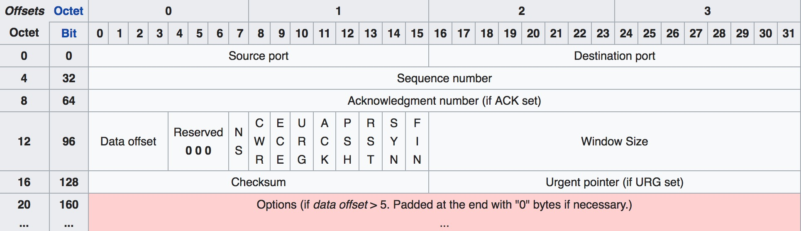

最近重读的 Stevens 老先生的TCP/IP详解，梳理了一下，打算把自己理解的写出来。  
TCP/IP是一种面向连接的、可靠的、基于字节流的传输层通信协议，它会保证数据不丢包、不乱序。TCP全名是Transmission Control Protocol，它是位于网络OSI模型中的第四层(Transport layer)。
### TCP 首部

- Port  
每个TCP数据段都包含源端口和目的端口号，用于寻找发送端和接收端的应用进程。这两个值加上IP首部中的源端IP和目的端IP地址唯有时候我们也会把它称为socket四元组（源IP地址、目的IP地址、源端口、目的端口）
- Sequence number  
序列号用来标识从TCP发送端向TCO接收端发送的数据字节流，它标识在这个报文段中的第一个数据字节。序号是32 bit的无符号数，序号到达232－1后又从0开始。TCP为应用层提供全双工服务。这意味数据能在两个方向上独立地进行传输。因此，连接的每一端必须保持每个方向上的传输数据序号。
- Acknowledgment number  
确认号，和序列号类似，**不过它是用来确认已经收到的序号并下次想收到的序号**。这两个序号保证了TCP传输过程中不乱序、不丢包的问题。
- TCP Flag  
NS：隐藏保护。  
CWR：发送主机设置拥塞窗口减少（CWR）标志，以指示它收到了一个设置了ECE标志的TCP段，并在拥塞控制机制中作出响应。  
ECE：ECN-Echo具有双重角色，具体取决于SYN标志的值。它表明：  
如果SYN标志设置为（1），则TCP对等体具有ECN能力。  
如果SYN标志为清除（0），则在正常传输期间接收到IP报头中具有拥塞经历标志设置（ECN = 11）的分组。这用作TCP发送方的网络拥塞（或即将发生的拥塞）的指示。  
URG：表示紧急指针字段是重要的  
ACK：表示确认字段是重要的。客户端发送的初始SYN数据包之后的所有数据包都应设置此标志。  
PSH：推送功能。要求将缓冲的数据推送到接收应用程序。  
RST：重置连接  
SYN：同步序列号。只有从每一端发送的第一个数据包应该设置此标志。其他一些标志和字段会根据此标志更改含义，有些仅在设置时有效，有些仅在明确时有效。  
FIN：来自发送方的最后一个数据包。  
关于SYN和FIN可以参考我这篇文章[TCP三次握手和四次挥手](https://zhaodezhen.github.io/dezhen.github.io/2019/03/15/TCP-3-way-and-4-way-handshake.html)
- Window size   
TCP的流量控制是由连接的每一端通过声明窗口大小来提供。Window size 是一个16bit的字段，所以窗口最大为65535。
- Checksum
它是有发送端计算，然后接收端进行验证。其目的是为了保证在传输过程中出现什么差错，如果校验和验证失败，TCP直接丢弃这个数据段（校验过程中会涉及到一个伪首部，伪首部的数据都是从IP数据报头获取的，其目的就是为了检测TCP数据段是否已经正确到达，只是单纯用来做校验的）。 
- Urgent pointer 
紧急指针，它只在URG标志设置为1的时候生效。  

### TCP 数据传输
TCP的建立连接之前写过一篇文章，所以就不在这里细赘了，我们直接聊TCP数据传输中如何保证数据的传输顺序和丢包问题的，以及怎么提高TCP传输的吞吐量。  
- Acknowledgement of delay  
通常TCP在收到数据的时候不会立刻发送一个ACK确认，它会延迟发送，可以和对方需要的数据一起发送（数据捎带ACK）或者是等待第二个数据来了直接回复第二个ACK，通常的实现采用的延迟是200ms(就是说它会等待200ms有没有数据一起发送)  
- Nagle   
在数据传输过程中，通常会遇到一些小分组的传输（比如 41 bit的数据分组，除去TCP首部和IP首部真正传输的数据只有1 bit），像这种小分组多的话，在网络上传输就加大了造成网络拥塞的可能。为了提传输效率，所以提出了Nagle算法。  
这个算法要求一个TCP连接最多只能有一个未被确认的未完成的小分组，在该分组到达之前不能发送其他的小分组。然后，TCP会收集这些小分组，并在确认到来时以一个分组的方式发送出去，这样就可以有效的减少了小分组。
在一些实时性要求比较高的场景下，采用了Nagle算法会让用户感觉到时延，所以我们可以选择关闭Nagle算法，Socket API 可以用 TCP_NODELAY 选项来关闭，nginx上的 tcp_nodely也是采用的这个系统调用。 
- Retransmission  
TCP为了保证数据不丢失所采用的重传策略。 TCP超时重传比较严重，它表示已经超时了还没有收到数据确认的回复，所以他会进入到慢启动，而快速重传则不用。  
TCP超时重传：TCP发送方首先会维护一个TCP的重传定时器(有的也叫超时时间RTO)，这个定时器是根据往返时间（RTT）进行计算，具体算法的实现可以参考 [RFC 6298](https://tools.ietf.org/html/rfc6298)，当RTO到了还没有收到数据的确认，那么TCP就认为数据已经丢失了。TCP会重传数据，接着进入到拥塞控制里的慢启动（关于拥塞控制会在后面讲）。   
TCP快速重传：**它主要是收到了三个重复的ACK后**（接受方如果收到的数据是乱序的。它会重发自己最近接收到的正确顺序的ACK）进行重传，因为收到重复的ACK代表数据已经发送过去了，其中的一个数据可能因为其他原因（如数据传输中换了比较远的路由，或者是数据干脆直接丢了）造成数据没有收到。所以这个情况不算太严重，它不会进入到慢启动，它会进入到快速恢复。  
TCP 在收到连续重复ACK后会重传最后顺序确认包的下一个，这样原先已经正确传输的包可能会重复发送，降低了TCP性能。为改善这种情况，发展出SACK（Selective Acknowledgement）技术，使用SACK选项可以告知发包方收到了哪些数据，发包方收到这些信息后就会知道哪些数据丢失，然后立即重传丢失的部分。

### TCP 滑动窗口  
- 滑动窗口  
TCP在双方数据传输的过程中，都会维护一个窗口，它代表了我还可以接受的数据的大小。如果接收方窗口大小为0，发送方就会停止发送。之所以叫滑动窗口（Sliding Window）是因为它是动态可变的，不是固定的（张开、合拢、收缩）。它保证了数据的可靠传递、它确保数据按顺序传递、并且它强制发送者之间的流量控制。
  
上图中我们可以看到：  
发送端的LastByteAcked指向了接收端最后一次顺序ACK的位置，LastByteSent指向了发送出的数据，但是还没有收到确认ACK。  
接收端的NextByteExpected指向了已经收到的最后一个连续数据，LastByteAcked指向了接收到的最后一个数据，其中的空白代表还未收到的数据。  
下面看一张滑动窗口的示意图：  

SND.UNA：已发送但尚未确认的数据的第一个字节的序列号。 这标志着传输类别＃2的第一个字节; 所有先前的序列号都是指传输类别＃1中的字节。  
SND.NXT：要发送到另一个设备（在这种情况下是服务器）的下一个数据字节的序列号。 这标志着传输类别＃3的第一个字节。     
SND.WND：发送窗口的大小。 回想一下，窗口指定任何设备在任何时候都可能具有“未完成”（ 未确认 ）的总字节数。 因此，添加第一个未确认字节（ SND.UNA ）和发送窗口（SND.WND ）的序列号标记发送类别＃4的第一个字节。
SND.UNA：已经发送但是尚未确认的
SND.NXT：将要发送的
SND.WND：发送窗口的大小
#1 表示已经确认过的数据，所以窗口右移，黑色代表窗口大小。   
#2 表示已经发送的，但是还没有收到确认。  
#3 表示还没有发送的，接受方可以接收的数据。  
#4 表示不能发送的数据，接收方不能接收的数据。

下面看一张TCP窗口滑动的示意图：
  
- 糊涂窗口  
我们看到了TCP通过让接收方指明窗口来进行流量控制，这将有效的组织发送方放松数据，直到窗口变为非0为止。但是其中会遇到一个问题，就是接收方发送的的的窗口更新数据丢失，这样会让发送方进入到无限等待状态，因为他要等待窗口更新为非0。为了解决这个问题TCP采用了坚持定时器（persist timer）去探测窗口更新。 
这样又会导致一种被称为“糊涂窗口综合症SWS (Silly Window Syndrome）”的状况。如果发生这种情况，则少量的数据将通过连接进行交换，而不是满长度的报文段。   
该现象可发生在两端中的任何一段，接受方可以通告一个小的窗口（而不是一直等待有大的窗口才通告），发送方也可以发送少量的数据（而不是等待其他的数据以便发送一个大的数据段）。可以在任何一端采取避免SWS的现象。  
1.接收方不通告小窗口。通常的算法是接收方不通告一个比当前窗口大的窗口（可以为0），除非窗口可以增加一个报文段大小（也就是将要接收的MSS）或者可以增加接收方缓存空间的一半，不论实际有多少。  
2.发送方避免出现糊涂窗口综合症的措施是只有以下条件之一满足时才发送数据：(a)可以发送一个满长度的报文段；(b)可以发送至少是接收方通告窗口大小一半的报文段；(c)可以发送任何数据并且不希望接收ACK（也就是说，我们没有还未被确认的数据）或者该连接上不能使用Nagle算法。
### TCP 拥塞控制  
TCP不仅可以可以控制端到端的数据传输，还可以对网络上的传输进行监控。这使得TCP非常强大智能，它会根据网络情况来调整自己的收发速度。网络顺畅时就可以发的快，拥塞时就发的相对慢一些。拥塞控制算法主要有四种：慢启动，拥塞避免，快速重传和快速恢复。  
- 慢启动和拥塞避免  
慢启动和拥塞避免算法必须被TCP发送端用来控制正在向网络输送的数据量。为了
实现这些算法，必须向TCP每连接状态加入两个参量。拥塞窗口（cwnd）是对发送端收到确
认（ACK）之前能向网络传送的最大数据量的一个发送端限制，接收端通知窗口（rwnd）是对
未完成数据量的接收端限制。cwnd和rwnd的最小值决定了数据传送。
另一个状态参量，慢启动阀值（ssthresh），被用来确定是用慢启动还是用拥塞避免
算法来控制数据传送。
在不清楚环境的情况下向网络传送数据，要求TCP缓慢地探测网络以确定可用流量，避免突然传送大量数据而使网络拥塞。在开始慢启动时cwnd为1，每收到一个用于确认新数据的ACK至多增加SMSS（SENDER MAXIMUM SEGMENT SIZE）字节。
慢启动算法在cwnd<ssthresh时使用，拥塞避免算法在cwnd>ssthresh时使用。当cwnd和ssthresh相等时，发送端既可以使用慢启动也可以使用拥塞避免。 
当拥塞发生时，ssthresh被设置为当前窗口大小的一半（cwnd和接收方通告窗口大小的最小值，但最少为2个报文段）。如果是超时重传，cwnd被设置为1个报文段（这就是慢启动，其实慢启动也不慢，它是指数性增长，只是它的起始比较低）当达到ssthresh时，进入拥塞避免算法（拥塞避免是线性增长）。

 
在该图中我们可以清楚的看到，ssthresh最初等于8 MSS 。 拥塞窗口在慢启动期间以指数方式快速上升并在第三次传输时达到ssthresh。 然后，拥塞窗口线性地爬升，直到发生丢失（超时），就在发送7之后。当发生丢失时，拥塞窗口是12 MSS 。 然后将ssthresh设置为6 MSS并且将cwnd设置为1，并且该过程继续。
- 快速重传和快速恢复   
当接收端收到一个顺序混乱的数据，它应该立刻回复一个重复的ACK。这个ACK的目的是通知发送端收到了一个顺序紊乱的数据段，以及期望的序列号。发送端收到这个重复的ACK可能有多种原因，可能丢失或者是网络对数据重新排序等。在收到三个重复ACK之后（包含第一次收到的一共四个同样的ACK），TCP不等重传定时器超时就重传看起来已经丢失（可能数据绕路并没有丢失）的数据段。因为这个在网络上并没有超时重传那么恶劣，所以不会进入慢启动，**而进入快速恢复**。快速恢复首先会把ssthresh减半(一般还会四舍五入到数据段的倍数)，然后cwnd=ssthresh+收到重复ACK报文段累计的大小。 

这个图上我们可以看出，在三次重复ACK后cwnd并没有进入到慢启动，而是进入到了快速重传。在第二段超时重传时，进入到了慢启动cwnd置1。
